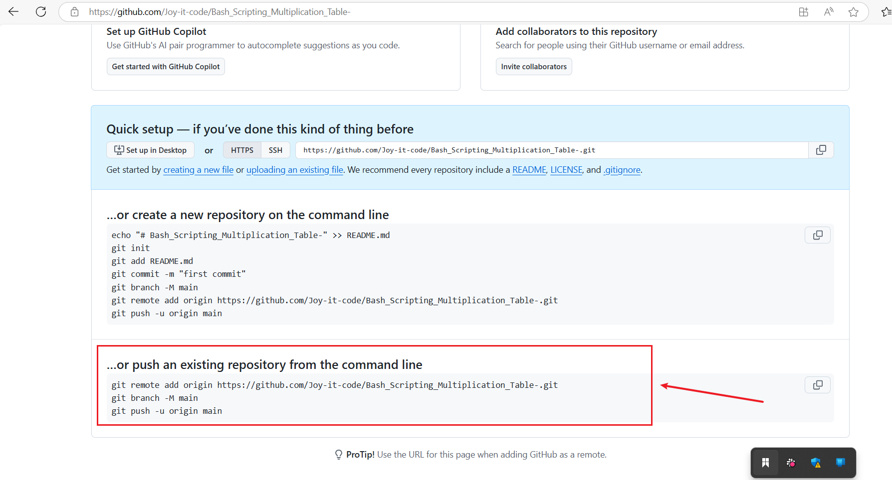

# Capstone Project - Linux Shell Scripting


## Bash Scripting for Generating a Multiplication Table

This project involves creating a Bash script to generate a multiplication table based on a number provided by the user. The project emphasizes using loops, handling user input, and applying conditional logic in Bash scripting.

### Project Description

**1. User Prompt:** The script prompts the user to: Enter a number for which they want to generate a multiplication table.

Choose whether they would like to see: A full multiplication table (from 1 to 10) or a partial table within a specified range.

2. **Dynamic Output:** Based on the user's choice, the script dynamically generates and displays the corresponding multiplication table.

### Project Requirements and Objectives

**. User Input for Number**: User can input the number for which the multiplication table will be generated.

**. Choice of Table Range:** Option to generate a full multiplication table (1 to 10) and option to generate a partial table by specifying the start and end of the range.

**. Implementation of Loops:** Uses both list-style loops and C-style loops and provides a comparison of syntax and between the two loop styles.

**. Conditional Logic:** If-else statements handle logic based on user choices, such as generating a full or partial table.

**. Input Validation:** Ensures valid numbers are entered for the table and range. Defaults to the full multiplication table if valid inputs are detected and provide feedback for invalid inputs.

**. Readable Output:** Outputs are formatted to be clear and user-friendly and allows users to choose between ascending or descending order for the table.

**. Well-commented Code:** Includes comments explaining key sections and logic for better readability and understanding.

### Task 1: Implement Version Control with Git

**. Initialize Git Repository:** To begin, create the project directory named **Bash_Scripting,** navigate into it, and initialize it as a Git repository.

```
mkdir Bash_Scripting
cd Bash_Scripting
git init
```


**.** Create a new file and save it with a .sh extension called multiplication_table.sh.


**Note:** For this project, I will use  **Visual Studio Code (VS Code)** for writing and testing Bash scripts is efficient because it provides a clean interface, extensions for syntax highlighting, and an integrated terminal.

### Task 2: Interactive Multiplication Table Generator Using Bash Scripting

This project is designed to be a pratical application of Bash scripting fundamentals, focusing on loops, conditional logic, and user interaction. By completing this task, you will gain valuable experience in automating tasks and improving your scripting proficiency.

1. Prompt the user to enter a number for the multiplication table.

2. Ask if they want a full table or partial table.

**.** if partial, prompt for the start and end numbers of the range.

3. Validate the range inputs and handle invalid or out-of-bound entries.

4. Generate and display the multiplication table according to the specified range.

5. Provide clear output formatting for ease of reading.

6. Enhanced User interaction: Incorporate additional checks or features, like repeating the program for another number without restarting the script.

7. Ask the user if they want to see the table in ascending or descending order combined with your loop of choice.

**Commands:**
```
#!/usr/bin/bash

# Function to generate and display the multiplication table
generate_table() {
    local number=$1
    local start=$2
    local end=$3
    local order=$4

    echo ""
    echo "Multiplication Table for $number from $start to $end ($order order):"
    echo "---------------------------------------------"

    if [[ $order == "asc" ]]; then
        for i in $(seq $start $end); do
            echo "$number x $i = $((number * i))"
        done
    else
        for i in $(seq $end -1 $start); do
            echo "$number x $i = $((number * i))"
        done
    fi
    echo "---------------------------------------------"
}

# Main loop for user interaction
while true; do
    # Prompt the user for a number
    echo -n "Enter a number for the multiplication table: "
    read number

    # Validate that the input is a number
    if ! [[ $number =~ ^[0-9]+$ ]]; then
        echo "Invalid input. Please enter a positive integer."
        continue
    fi

    # Ask if the user wants a full or partial table
    echo -n "Do you want a full table (1-10) or a partial table? (full/partial): "
    read choice

    if [[ $choice == "full" ]]; then
        start=1
        end=10
    elif [[ $choice == "partial" ]]; then
        # Prompt for the start and end of the range
        echo -n "Enter the starting number of the range: "
        read start
        echo -n "Enter the ending number of the range: "
        read end

        # Validate the range
        if ! [[ $start =~ ^[0-9]+$ && $end =~ ^[0-9]+$ ]]; then
            echo "Invalid range inputs. Please enter positive integers."
            continue
        fi
        if (( start > end )); then
            echo "Invalid range. Start cannot be greater than end."
            continue
        fi
    else
        echo "Invalid choice. Please enter 'full' or 'partial'."
        continue
    fi

    # Ask if the user wants ascending or descending order
    echo -n "Do you want the table in ascending or descending order? (asc/desc): "
    read order
    if [[ $order != "asc" && $order != "desc" ]]; then
        echo "Invalid choice. Please enter 'asc' or 'desc'."
        continue
    fi

    # Generate and display the multiplication table
    generate_table $number $start $end $order

    # Ask if the user wants to repeat
    echo -n "Do you want to generate another multiplication table? (yes/no): "
    read repeat
    if [[ $repeat != "yes" ]]; then
        echo "Thank you for using the Multiplication Table Generator. Goodbye!"
        break
    fi
done
```

**.** Output for Partial Multiplication Table (Ascending)


**.** Output for Full Multiplication table (Descending) 


**.**  Output for Invalid Input and Choice


### Task 3: Stage and Commit the Template to Git

In this step, i will add the website files to the Git repository, configure my global Git settings, and make an initial commit with a descriptive message.

  **.** Add Files: Add all website files to the staging area.

  **.** Configure Git User Information: Set up global configuration with my actual git username and email address.

  **.** Commit Changes: Commit the changes with a clear and descriptive message.

  **Commands:**
```
git add .
git config --global user.name "YourName"
git config --global user.email "YourEmail"
git commit -m "Initial commit for Bash Scripting Multiplication Table project"
```


### Task 4: Push the code to your Github repository

After initializing your Git repository and adding your Bash scripting multiplication table, the next step is to push your code to a remote repository on GitHub. This step is crucial for version control and collaboration.

  **.** Create a Remote Repository on GitHub: Log into your GitHub account and create a new repository named Bash_Scripting_Multiplication_Table. Leave the repository empty without initializing it with a README, .gitignore, or license.




**.** Link Your Local Repository to GitHub: In your terminal within your project directory, add the remote repository URL to your local repository configuration.

**.** Push Your Code: Upload your repository content to GitHub, use the following command to push your commits from your local main branch to the remote repository. this enables you to store your project in the cloud and share it with others.

**Commands:**

```
git remote add origin https://github.com/Joy-it-code/Bash_Scripting_Multiplication_Table-.git
git branch -M main
git push -u origin main
```


